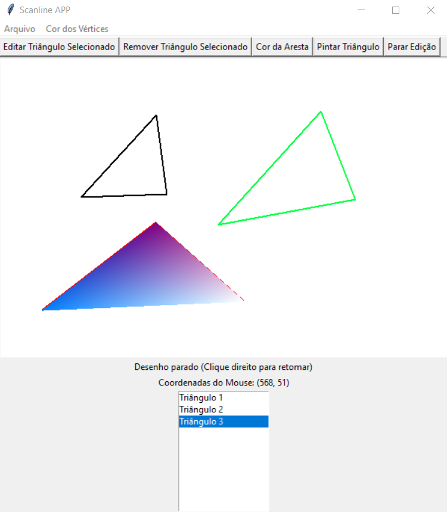

# Rasterização Scanline com Aritmética Incremental e/ou Coordenadas Baricêntricas

## Sistema Geral
O software oferece ao usuário a capacidade de desenhar um ou mais triângulos na tela, proporcionando a opção de escolher a cor das arestas. Além disso, há a funcionalidade de preencher os triângulos de forma cromática, permitindo que o usuário determine as cores dos vértices. A funcionalidade de preenchimento cromático utiliza o algoritmo de rasterização com aritmética incremetnal ou coordenadas baricêntricas para efetuar o processo de coloração do polígono criando uma transição suave de cores, de acordo com a escolha do usuário. A imagem abaixo ilustra parcialmente essas características.



Outros requisitos também foram adicionados para auxiliar o usuário, tais como:
- O usuário pode selecionar qualquer um dos triângulos desenhados
- O usuário pode editar a dimensão de qualquer um dos triângulos
- O usuário pode excluir qualquer um do triânngulos
- O usuário pode limpar a tela, reiniciando o processo

## Como Usar
Para executar o código use:
``` 
python3 barricentrico.py 

ou

python3 rasterizado.py
```
Se precisar instalar a biblioteca tkinter use:
```
sudo apt-get install python3-tk
```
Versões utilizadas:
```
versão python: 3.11
versão pip: 23.3.2
versão tkinter: 8.6
```
SOs utilizados para testes:
```
Windows 10 - Visual Studio Code 1.85.2 
WSL - Ubuntu 20.04.4 LTS
```
